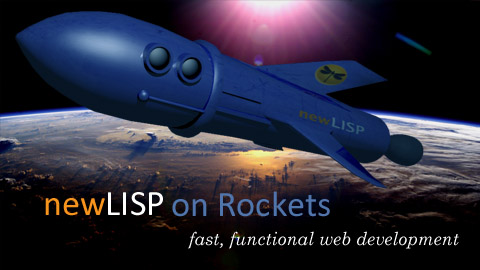

# Introduction

Rockets is a fast, fun, and customizable blog application that is open source. It runs on the Linux platform.

# Why Rockets?

You may be interested in running Rockets if you:

* Want to experiment with an easy-to-learn web application framework
* Are interested in LISP and LISP-like languages
* Feel like trying something different

If you are looking for a full-featured blog application with tons of available themes and plugins, you probably want something like 
[WordPress](wordpress.org) instead.

# Installing Rockets

To install Rockets, you will need a Linux operating system. This can be:

* A version of Linux installed on your home computer as the main operating system
* A version of Linux running on a virtual machine (such as VirtualBox)
* A version of Linux installed on a cloud service provider, such as Amazon AWS or Linode

If you are just experimenting at home, the first two options are fine. If you want to run Rockets as a public website, you will need to 
choose the third option. Most home Internet service providers don't allow you to run public websites from your home computer.

For step-by-step instructions, click one of the links below:

* Automated installation guide for Rockets on Ubuntu 20.04 (recommended for experimentation)
* Complete installation guide using the Linode cloud provider (recommended for public websites)
* Manual installation guide for Rockets on non-Ubuntu Linux operating systems 

# Running your Rockets blog

# Customizing your Rockets blog

# How Rockets Works

# Extending Rockets

# Developing for Rockets

# The Future of Rockets

# Rockets API reference

(work in progress)
